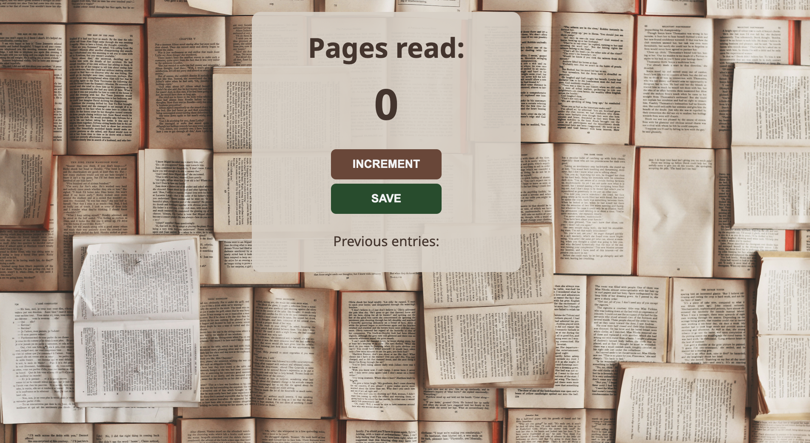

# Page Counter

Page Counter is a simple JavaScript application designed to help readers keep track of the number of pages they have read.

## Table of Contents

- [Features](#features)
- [Usage](#usage)
- [Credits](#credits)
- [License](#license)
- [Questions](#questions)

## Features

- **Incremental Page Counting**: Easily add to your page count with a simple click of a button.
- **Session Saving**: Save the count of pages read during each reading session and display them for future reference.
- **Responsive Design**: Works on both desktop and mobile devices, adapting to screen size for optimal viewing.
- **Stylish UI**: A clean and modern user interface with a soothing color scheme and easy-to-read typography.

## Usage

To use the Page Counter app, follow these simple steps:

1. **Open the App**: Visit [Page Counter](https://adriannaderkacz.github.io/page-counter/) to access the app directly from your web browser. 
2. **Increment Count**: Click on the "INCREMENT" button to increase the count of pages as you read.
3. **Save Session**: Press the "SAVE" button to save the current count. This will reset the counter for a new session but keep your previous total visible under "Previous entries".

## Credits

- **Background Picture:** The background image used in this project is sourced from [Unsplash](https://unsplash.com/photos/open-book-lot-Oaqk7qqNh_c).
 - **Colour Palettes:** Colour schemes were inspired by and chosen from [Coolors](https://coolors.co/).
- **Project Idea:** [Scrimba Frontend Career Path](https://scrimba.com/learn/frontend).

## License
  MIT License

  Copyright (c) [2024] [AdriannaDerkacz]

  Permission is hereby granted, free of charge, to any person obtaining a copy of this software and associated documentation files (the "Software"), to deal in the Software without restriction, including without limitation the rights to use, copy, modify, merge, publish, distribute, sublicense, and/or sell copies of the Software, and to permit persons to whom the Software is furnished to do so, subject to the following conditions:

  The above copyright notice and this permission notice shall be included in all copies or substantial portions of the Software.

  THE SOFTWARE IS PROVIDED "AS IS", WITHOUT WARRANTY OF ANY KIND, EXPRESS OR IMPLIED, INCLUDING BUT NOT LIMITED TO THE WARRANTIES OF MERCHANTABILITY, FITNESS FOR A PARTICULAR PURPOSE AND NONINFRINGEMENT. IN NO EVENT SHALL THE AUTHORS OR COPYRIGHT HOLDERS BE LIABLE FOR ANY CLAIM, DAMAGES OR OTHER LIABILITY, WHETHER IN AN ACTION OF CONTRACT, TORT OR OTHERWISE, ARISING FROM, OUT OF OR IN CONNECTION WITH THE SOFTWARE OR THE USE OR OTHER DEALINGS IN THE SOFTWARE.

  ## Questions
  For questions, please contact me at a.derkacz@gmail.com.
  GitHub: [adriannaderkacz](https://github.com/adriannaderkacz).

